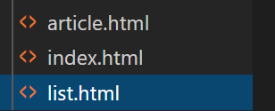
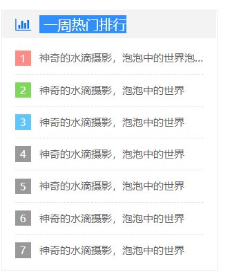
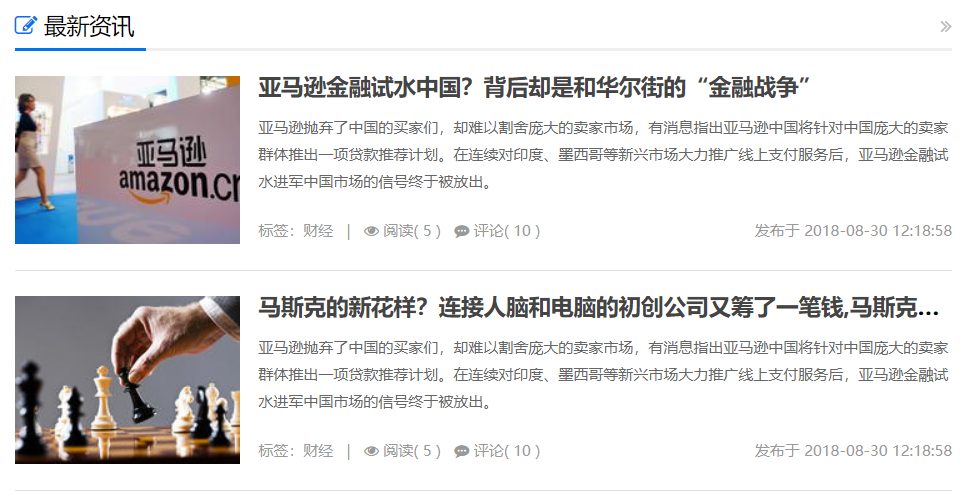
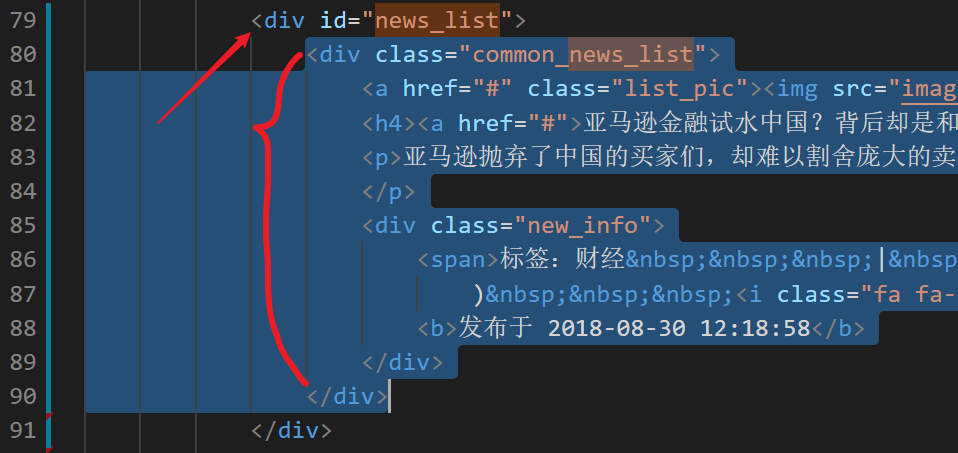
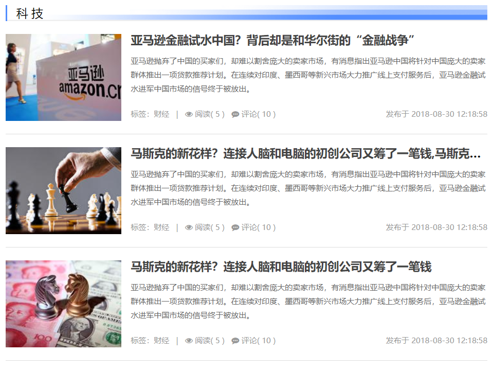

大事件 -  游客功能开发



一共有三个页面：

- index.html 主页
- list.html列表页
- article.html详情页


## 首页-文章类别获取

游客的功能代码放在web_front这个目录中，要与web_back的处理一样，建立一个专门文件夹，来保存接口地址设置及模块代码。这里的模块代码基本可以直接使用，要根据实现情况修改接口地址 ，和方法。


使用 Ajax 请求获取数据


### 模板

```
<script type="text/html" id="temp_cate">
        {{each data item}}
            <li><a href="#">{{item.name}}</a></li>
        {{/each}}
    </script>
```

### 模板渲染

- 引入必要的js文件

```javascript
<script src="./js/jquery-1.12.4.min.js"></script>
    <script src="./js/template-web.js"></script>
    <script src="./js/util/config.js"></script>
    <script src="./js/util/category.js"></script>
    <script>
        // 1. 获取文章的类型并显示
        category.get().then(function(res){
            console.log(res);
            // 渲染结构
            var htmlStr = template('cate', res)
            console.log(htmlStr);
            // 显示
            // 替换整个容器中的html
            $('#left_menu').html(htmlStr); 

            // 追加一些内容
            $('#level_two_menu').append(htmlStr ) 
        })
    </script>
```

#left_menu， #level_two_menu 分别是两不同的容器，都要显示所有的文章类型。


### 补充 html,append

它们都是jquery的方法：

$().html(html代码)： 功能是用 实参（html代码）去替换jquery对象中的html。

$().append(html代码)： 功能是向jquery对象中的html 结构中追加实参(html代码)。

## 首页中的焦点图


### 思路

​	调用接口，获取数据，template渲染

### 步骤


在config.js中添加接口地址

```javascript
// 接口的基地址
var baseUrl = 'http://localhost:8000/'

// 把所有要用到的接口地址进行集中管理
var APIURLS = {
   
    category_show: baseUrl + 'admin/category_search',

    // 获取文章
    article_get: BASEURL + '/search',

}
```


在article.js中添加方法

```
var article = {

/**
     * 获取主页中5条焦点图新闻
     */
    getFouceFive:function(){
        // 因为只要5条数据，所以直接设置只获取5条
        return $.get(APILIST.article_get,{perpage: 5})
    }
}
```


index.html

 模板

```
<!-- 焦点图 
    注意：只有第一个li才有first的类，其它是没有的
    -->
    <script id="focus" type="text/html">
        {{each data item idx}}
            {{if idx == 0}}
                <li class="first">
            {{else}}
                <li>
            {{/if}}
                    <a href="#"></a>
                    <p>{{item.title}}</p>
                </li>
        {{/each}}
    </script>
```

注意：在模板引擎中对if的处理。**if else /if**

js

```javascript
// 2. 显示焦点图
//  调用接口，获取数据，template渲染
article.getFouceFive().then(function(res){
    console.log(res);
    if(res.code === 200){
        // 渲染
        var htmlStr = template("focus", res)
        console.log(htmlStr);
        $('#focus_list').html(htmlStr )

    } else{
        alert(res.msg)
    }

})
```


##  首页一周热门排行



### 思路

​	调用接口，获取数据，template渲染


### 步骤

config.js中添加接口

```javascript
var APILIST = {
    
    // 获取文章分类
    category_get:  BASEURL + '/category',
  
    // 获取文章
    article_get: BASEURL + '/search',

    // 获取热门文章排行
+    article_rank:BASEURL + '/rank',
}
```


article.js中添加方法

```javascript
// 把所有与文章相关的操作写在这里

var article = {
    // .....
    
    
    /**
     * 获取文章排行
     * @param {*} type 
     */
    getRank:function(type){
        return $.get(APILIST.article_rank,{'type':type})
    }
    
}
```


index.html中调用方法并渲染

模板

```html
<!-- 排行榜
        前三名有自已的class
    -->
    <script id="tmpRank" type="text/html">
        {{each data item idx}}
            {{if idx == 0}}
                <li><span class="first">{{idx+1}}</span><a href="#">{{item.title}}</a></li>
            {{else if idx == 1}}
                <li><span class="second">{{idx+1}}</span><a href="#">{{item.title}}</a></li>
            {{else if idx == 2}}
                <li><span class="third">{{idx+1}}</span><a href="#">{{item.title}}</a></li>
            {{else}}
                <li><span>{{idx+1}}</span><a href="#">{{item.title}}</a></li>
            {{/if}}
        {{/each}}
    </script>
```

代码

```javascript
// 3. 显示排行文章
//  调用接口，获取数据，template渲染
article.getRank().then(function(res){
    console.log(res);
    if(res.code === 200){
        // 渲染
        var htmlStr = template('tmpRank',res)
        console.log(htmlStr);
        $('#rank').html(htmlStr )

    } else {
        alert(res.msg)
    }
})
```


## 首页-最新资讯



### 思路

​	调用接口，获取数据，template渲染


### 步骤

config.js添加接口地址

```javascript
var APILIST = {
    
    // ...

    // 最新文章
    article_last:BASEURL + '/lastest'
}
```


article.js中添加方法

```javascript
// 把所有与文章相关的操作写在这里

var article = {
    // ...
    /**
     * 获取最新的文章
     */
    getLastest:function(){
        return $.get(APILIST.article_last)
    }
    
}
```


index.html中调用方法，并渲染

模板

```html
<!-- 最新资讯 -->
    <script id="tmpNews" type="text/html">
        {{each data item}}
            <div class="common_news_list">
                <a href="#" class="list_pic"></a>
                <h4><a href="#">{{item.title}}</a></h4>
                <p>{{item.intro}}</p>
                <div class="new_info">
                    <span>标签：{{item.type}}&nbsp;&nbsp;&nbsp;|&nbsp;&nbsp;&nbsp;<i class="fa fa-eye"></i>&nbsp;阅读({{item.read}}
                        )&nbsp;&nbsp;&nbsp;<i class="fa fa-commenting"></i>&nbsp;评论( {{item.comment}} )</span>
                    <b>发布于 {{item.date}}</b>
                </div>
            </div>
        {{/each}}
    </script>
```

代码

```javascript
//4. 最新资讯
article.getLastest().then(function(res){
    console.log(res);
    if(res.code === 200){
        // 渲染
        var htmlStr = template('tmpNews',res)
        console.log(htmlStr);
        $('#news_list').html(htmlStr )

    } else {
        alert(res.msg)
    }
})
```

注意：改造一下dom结构，用一个统一的div去包含列表




## 列表页-文章类别获取并高亮

思路：

- 在其它的页页，跳入列表页时，注意要传入参数进来。 list.html?id=XXX

- 在list.html中从地址栏中获取id的值
- 调用接口，获取数据，使用template进行渲染
- 高亮的效果是通过在模板中进行判断，来决定是否要添加cur类


步骤

获取id

```javascript
var id = window.location.search.substr(4)
```


建立模板

```html
<!-- 
        文章类型
        把当前的列表中对应的文章编号高亮显示
        如果是 id=1 ， 则 科学 这个项目应该是处于选中状态
        curId: 是我们人为在res的基础上添加一个属性
    -->
    <script id="cate" type="text/html">
        {{each data item}}
            {{if item.id == curId}}
                <li class="cur"><a href="./list.html?id={{item.id}}">{{item.name}}</a></li>
            {{else}}
                <li><a href="./list.html?id={{item.id}}">{{item.name}}</a></li>
            {{/if}}

        {{/each}}
    </script>
```

代码

```javascript
// 1. 从地址栏中获取出id
// window.localtion  http://127.0.0.1:5500/web_front/list.html?id=1
// window.location.search  ?id=1
var id = window.location.search.substr(4)

// 2. 显示菜单导航菜单，并把当前的文章类别高亮显示 
// 获取文章的类型并显示
category.get().then(function(res){
    
    // 补充一个属性来保存当前的类别编号，以方便在模板内部来获取这个编号
    res.curId = id
    
    console.log(res);
    // 渲染结构
    var htmlStr = template('cate', res)
    // console.log(htmlStr);
    // 显示
    // 替换整个容器中的html
    $('#left_menu').html(htmlStr); 

    // 追加一些内容
    $('#level_two_menu').append(htmlStr ) 
})

```


>  在css样式中，补充cur这个类，以达到高亮的效果。


## 列表页-内容展示



思路：

- 根据当前的类型id去取出文章列表信息，并渲染
- 这里有分页（复习一下之前学习的分页）


### 基本显示

在article.js中补充一个方法

```javascript
/***
     * 在列表页中，用来获取文章列表数据
     * type: 文章类型编号
     * page: 当前第几页
     */
    getList:function(type,page) {
        return $.get(APILIST.article_get,{'type':type,'page':page})
    }

```

在list.html中调用方法，渲染数据

模板

```
<!-- 文章列表 -->
    <script id="tmpNews" type="text/html">
        {{each data item}}
            <div class="common_news_list">
                <a href="#" class="list_pic"></a>
                <h4><a href="#">{{item.title}}</a></h4>
                <p>{{item.content}}</p>
                <div class="new_info">
                    <span>标签：{{item.type}}&nbsp;&nbsp;&nbsp;|&nbsp;&nbsp;&nbsp;<i class="fa fa-eye"></i>&nbsp;阅读({{item.read}}
                        )&nbsp;&nbsp;&nbsp;<i class="fa fa-commenting"></i>&nbsp;评论( {{item.comment}} )</span>
                    <b>发布于 {{item.date}}</b>
                </div>
            </div>
        {{/each}}
    </script>
```

代码：

```javascript
// 3. 显示文章列表
var curPage = 1; // 当前的要取回第几页的文章

article.getList(id,curPage).then(function(res){

    console.log(res);
    var htmlStr = template('tmpNews',res)
    // 数据渲染
    console.log(htmlStr);
    $('#list').html( htmlStr )


})
```


### 分页


## 查看文章详情

在index.html中添加跳转链接。

修改一下模板：

```
    <script id="temp_foucsList" type="text/html">
        {{each data item idx}}
            {{if idx == 0}}
                <li class="first">
+                    <a href="article.html?id={{item.id}}"></a>
                    <p>{{item.title}}</p>
                </li>
            {{else}}
                <li>
 +                   <a href="article.html?id={{item.id}}"></a>
                    <p>{{item.title}}</p>
                </li>
            {{/if}}
        {{/each}}
    </script>
```

添加跳转的路径及参数id。


在article.html中获取id，发请求取回文章的详情，再显示在页面上

```javascript
// 1. 从地址栏中获取id
// http://127.0.0.1:5500/web_front/article.html?id=1574515438675
var id = location.search.substr(4);
// alert(id)
// 2. 根据id去请求文章详情，并显示
article.getDetail(id,function(res){
    console.log(res);
    // 把res.data中的数据，展示在dom中
    $('#article_title').text(res.data.title)
    $('#article_author').text(res.data.author)
    $('#article_date').text(res.data.date)

    // res.data.content: 保存是html代码
    // $('#article_content').text(res.data.content)
    $('#article_content').html(res.data.content)

})
```


## 添加评论

config.js 添加接口地址

```
// 接口的基地址
var baseUrl = 'http://localhost:8000/'

// 把所有要用到的接口地址进行集中管理
var APIURLS = {
   
    category_show: baseUrl + 'admin/category_search',

    // 文章搜索的地址
    article_show: baseUrl + 'admin/search',

    // 评论
+    comment_add: baseUrl + 'post_comment'
}
```


comment.js添加方法

```
// 文章评论
var comment = {
+    add: function(name,content,aritcle_id){
        return $.post(APIURLS.comment_add, 
            {
                'name': name,
                'content': content,
                'aritcle_id': aritcle_id,

            }
        )
    }
}
```


article.html 调用方法

```javascript
// 添加评论
$('#btnAdd').click(function(){
    // 1. 获取信息
    var name = $('#comment_name').val().trim();
    var content = $('#comment_content').val().trim();
    // 2.判断是否为空
    if(name === '' || content === ''){
        alert('不能为空')
        return;
    }
    // 3. 调用方法，添加 
    comment.add(name, content, id).then(function(res){
        console.log(res);
        if(res.code === 200){
            // 清空留言区域
            $('#comment_name').val('')
            $('#comment_content').val('')
            // 再次加载显示留言
        }

    } )
})
```


## 展示评论


在config.js

```
// 整个项目的基地址
var baseUrl = 'http://localhost:8000/'

// 列出所有用过的接口的地址
var APIURLS = {
   category_show: baseUrl + 'admin/category_search',
   article_show: baseUrl + 'admin/search',

   comment_add: baseUrl + 'post_comment',
+   comment_get: baseUrl + 'get_comments'
}
```


在comment.js

```j
var comment = {
    add:function(name,content,article_id ){
        return $.post(APIURLS.comment_add,{
            'name': name,
            'content' : content,
            'article_id': article_id
        }
    },
+    get:function(article_id){
        return $.get(APIURLS.comment_get,
            {   
                'article_id': article_id
            }
        )
    }
}
```


在article.html

准备模板

```

<script src="./js/template-web.js"></script>
    <script id="temp_comment" type="text/html">
        {{each data item}}
        <div class="comment_detail_list">
            <div class="person_pic fl">{{item.name.substr(0,1)}}</div>
            <div class="name_time fl"><b>{{item.name}}</b><span>{{item.dt}}</span></div>
            <div class="comment_text fl">
                {{item.content}}
            </div>
        </div>
        {{/each}}
    </script>
```


```javascript
// 获取评论
function getAndShow(){
    comment.get(id).then(function(res){
        console.log(res.data);
        res.data.reverse()
        // 用模板引擎 渲染数据
        var htmlStr = template('temp_comment',res);
        $('#comment_list').html( htmlStr )

    })
}
getAndShow();
```

## 小结

1. 模块化

   1. js/utils/congfig.js 公共的
   2. js/utils/user.js 某个模块

2. 使用git时记得一个功能完成后要提交一次

3. 代码量积累：接口的调试，使用

4. 插件&工具

   1. 富文本编辑器
   2. day.js
   3. echart.js
   4. 模板引擎：template-web.js
   5. bootbox.js

